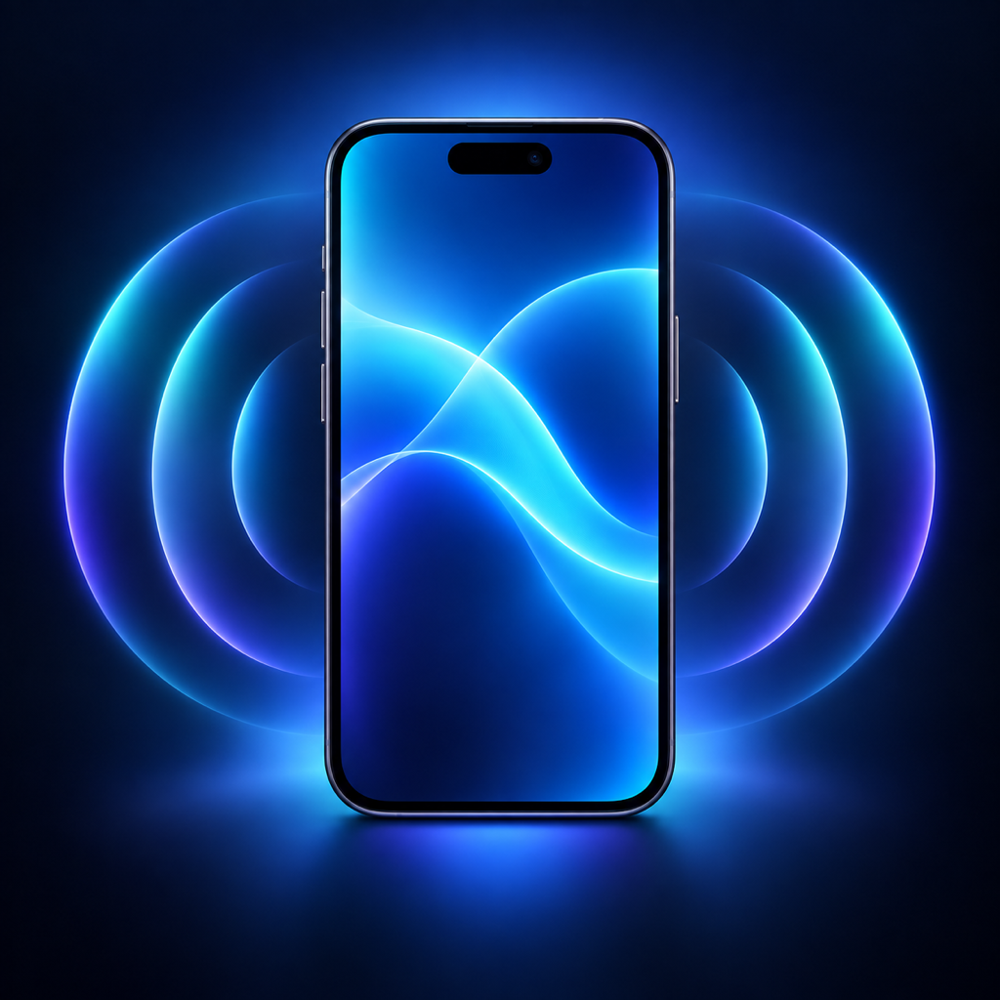

<div align="center">
  
  <h1>iPhone Mirroring</h1>
  <p><strong>Historical umbrella repository for three independent iPhone mirroring prototypes.</strong></p>
  <p>
    
    
    
  </p>
</div>

> [!IMPORTANT]
> Active development is separated into three standalone repositories: **[iPhone Vision with Mac Bridge](https://github.com/charlie908/iPhone-Vision-with-Mac-Bridge)**, **[iPhone Vision Direct](https://github.com/charlie908/iPhone-Vision-Direct)**, and **[Mac iPhone Mirroring for EU Countries](https://github.com/charlie908/Mac-iPhone-Mirroring-for-EU-Countries)**. This umbrella snapshot is retained for context and history.

> [!WARNING]
> These are early experimental developer prototypes, not equivalents of an Apple-integrated feature. Apple's sandbox, private Continuity technologies, and public-API restrictions mean that third-party implementations must rely on user-approved ReplayKit capture and developer-signed XCTest/DeviceKit automation. Expect more setup, latency, and limitations than software implemented directly by Apple with private system privileges.

> [!CAUTION]
> The software is provided **as is**, without warranty. To the fullest extent permitted by law, Charles M. and contributors are not responsible for device problems, data loss, service interruption, bugs, or other damage resulting from its use.

This repository began as a collection of three related prototypes for viewing and controlling an iPhone without holding it. Each project addresses a different environment: a bridged Vision Pro setup, a direct Vision Pro connection, or a native Mac window.

The projects use ReplayKit for user-approved screen capture, hardware H.264 encoding/decoding for low latency, and XCTest/DeviceKit automation for input injection. They are developer tools, not App Store-ready applications.

> [!IMPORTANT]
> You must build and sign every Apple-platform target with your own Apple Developer account. No certificates, provisioning profiles, device identifiers, or personal network addresses are included.

## Choose a project

| | Project | Runtime path | Best for | Mac required while using it? |
|---|---|---|---|---|
|  | **[iPhone Vision with Mac Bridge](https://github.com/charlie908/iPhone-Vision-with-Mac-Bridge)** | iPhone → Mac relay → Vision Pro | The established Vision Pro experience on one trusted LAN | Yes |
|  | **[iPhone Vision Direct](https://github.com/charlie908/iPhone-Vision-Direct)** | iPhone ↔ Vision Pro | Travel, Personal Hotspot, or direct use | No, after building/installing |
|  | **[Mac iPhone Mirroring for EU Countries](https://github.com/charlie908/Mac-iPhone-Mirroring-for-EU-Countries)** | iPhone ↔ Mac | Mac mirroring and control, especially where Apple's feature is unavailable in Europe or elsewhere | Yes—the Mac is the viewer |

All three projects are deliberately separate. Their app identifiers, ReplayKit extensions, Bonjour services, and control services do not need to replace one another.

## Current versions

| Project | Version | Status | Tested capabilities |
|---|---:|---|---|
| iPhone Vision with Mac Bridge | `0.1.0-alpha` | Working prototype | H.264 video, tap, swipe, text, Home, Lock, volume, focus UI, keep-awake |
| iPhone Vision Direct | `0.1.0-alpha` | Working prototype | Peer-to-peer video and controls, Wi-Fi and iPhone Personal Hotspot |
| Mac iPhone Mirroring for EU Countries | `0.1.0-alpha` | Working prototype | Native Mac window, mouse/trackpad gestures, keyboard, resize/move, shortcuts |

The repository uses an `0.1.0-alpha` release label; individual Xcode targets currently retain their original `1.0`/build `1` metadata. These snapshots work in the original development setup, but installation is still manual and OS/Xcode updates may require changes.

## Shared requirements

- A Mac with a recent Xcode version that supports the deployment targets.
- Xcode command-line tools.
- An Apple Developer account for local signing.
- Developer Mode enabled on the iPhone and Apple Vision Pro.
- The iPhone paired with the development Mac for XCTest/DeviceKit installation.
- [XcodeGen](https://github.com/yonaskolb/XcodeGen) when regenerating projects from `project.yml`.
- Python 3.10+ for the iPhone Vision with Mac Bridge relay only.

Current project settings target iOS 15/16+, macOS 15.0, and visionOS 27.0 depending on the component. Developers may lower deployment targets where the APIs allow it.

## How it works

```text
                              ┌─────────────────────────┐
                              │ Apple Vision Pro        │
                    H.264 ───▶│ Mac Bridge / Direct     │
                    input ◀───│ native viewer           │
                              └─────────────────────────┘
                                ▲                 ▲
                                │ Mac relay       │ peer-to-peer
                                │ (Mac Bridge)    │ (Vision Direct)
                                ▼                 ▼
┌─────────────────────────┐   H.264/input   ┌─────────────────────────┐
│ Mac                     │◀───────────────▶│ iPhone                  │
│ Mac mirroring app       │                 │ ReplayKit + DeviceKit   │
└─────────────────────────┘                 └─────────────────────────┘
```

See [Architecture](docs/ARCHITECTURE.md) for protocols, ports, and component boundaries.

## Safety and privacy

- Screen capture never starts silently. iOS always displays the ReplayKit confirmation UI.
- The prototypes can expose unauthenticated video/control services on the local network.
- Use them only on a trusted network. Never forward their ports to the public internet.
- The repositories contain source and assets only—no signed application bundles.
- Secure or DRM-protected content may appear black, and some protected UI cannot be automated.

Please read [SECURITY.md](SECURITY.md) before running or modifying the projects.

## Repository layout

```text
assets/                     Shared icons used by this README
docs/                       Architecture and project notes
projects/phoneview/         historical Mac-bridge Vision Pro snapshot
projects/iphone-direct/     historical direct Vision Pro snapshot
projects/iphone-mac/        historical Mac mirroring snapshot
.github/                    Issue and pull-request templates
```

## Contributions

I am not a professional software developer; these projects are first working drafts created to demonstrate what is possible. Contributions are more than welcome. Useful areas include easier device discovery, authenticated transport, automatic configuration, audio, landscape handling, latency measurement, reconnect behavior, compatibility, accessibility, and clearer installation tooling.

Please read [CONTRIBUTING.md](CONTRIBUTING.md). If you distribute a modified or integrated solution, retain the attribution in [NOTICE](NOTICE), as required by the Apache 2.0 licensing terms for this repository's original work.

## Credits and third-party work

The original prototypes were developed by **Charles M.** See [NOTICE](NOTICE) and [Third-party notices](THIRD-PARTY-NOTICES.md).

The projects build on open development tools including DeviceKit and, for the Mac-bridge variant, modifications to `ios-web-streamer`. Because the referenced `ios-web-streamer` snapshot does not include an explicit license, this repository provides a patch and bootstrap instructions rather than copying its upstream source.

## Disclaimer

This project is independent, experimental, and not affiliated with or endorsed by Apple Inc. Apple, iPhone, Mac, Apple Vision Pro, iOS, macOS, visionOS, ReplayKit, and Xcode are trademarks of Apple Inc.
